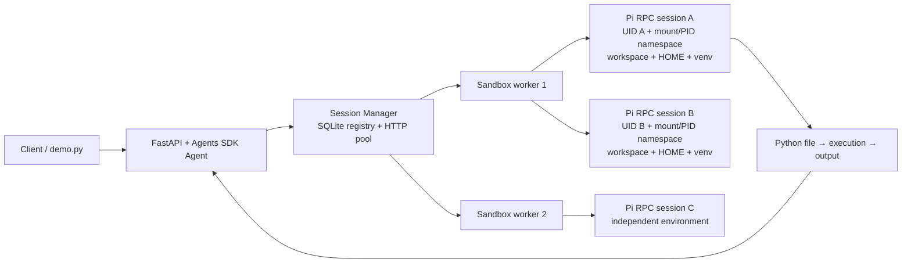

# OpenAI Agents SDK → Pi coding agent sandboxes

可用 Docker Compose 啟動的 Python 範例。外層使用真正的 `openai-agents` 建立 Agent，將使用者任務交給 `run_python_in_sandbox` function tool；工具透過 Session Manager 找到指定 worker 上的 pi RPC session。Pi 自己寫 Python 檔案、呼叫 bash 工具執行，再將結果送回外層 Agent。

已支援每個 session 獨立的 **skills、pi extensions 與 pi packages**，包含原生 package 安裝／移除、資源查詢／reload，以及離線和真實模型 demo。詳細 API、資源目錄及自訂方式見 [資源支援與 demo](docs/resources.md)。



## 快速開始

需要 Docker Engine / Docker Desktop 的 Linux containers 與 Docker Compose；第一次建置需要網路。主機不需要安裝 Python、Node.js 或 pi。

```bash
cp .env.example .env
# 編輯 .env，填入 OPENAI_API_KEY；依需求更換模型及兩組 token
docker compose up --build -d --wait
docker compose exec api python scripts/demo.py
```

Skills／extensions／packages 的離線 demo（不需 API key）：

```bash
docker compose exec api python scripts/demo_resources.py
# 加 --live 會使用真實模型執行 skill 與 Agents SDK 委派
```

Demo 建立一個邏輯 Agent 以及三個 pi sessions：兩個在 `sandbox-1`、一個在 `sandbox-2`。它會依序示範平方和、同 worker 檔案隔離、跨 worker Fibonacci 計算，最後回到第一個 session 讀取先前檔案繼續計算。Sessions 保留，便於繼續操作。

API 文件：<http://localhost:8000/docs>。所有操作 API 都需 `Authorization: Bearer <API_TOKEN>`；`/health` 不需 token。預設只發布到主機的 `127.0.0.1`，worker port 不發布到主機。Swagger 可在各 operation 的 `authorization` header 欄位填入完整 Bearer 字串。

沒有 API key 也能啟動、建立 sessions 及跑下列離線測試，但 `/run` 會回傳 503。外層與 pi 預設使用 `gpt-4.1-mini`；可以分別設定 `OPENAI_MODEL`、`PI_MODEL`。本範例的 pi provider 固定為 OpenAI。

## 呼叫 API

以下使用 `curl`、`jq`，token 必須與 `.env` 一致：

```bash
export DEMO_TOKEN=local-demo-change-me
export BASE_URL=http://localhost:8000

curl -sS "$BASE_URL/sandboxes" -H "Authorization: Bearer $DEMO_TOKEN"

AGENT_ID=$(curl -fsS -X POST "$BASE_URL/agents" \
  -H "Authorization: Bearer $DEMO_TOKEN" | jq -r .agent_id)

SESSION_ID=$(curl -fsS -X POST "$BASE_URL/agents/$AGENT_ID/sessions" \
  -H "Authorization: Bearer $DEMO_TOKEN" -H 'Content-Type: application/json' \
  -d '{"sandbox_id":"sandbox-1"}' | jq -r .id)

curl -fsS -X POST "$BASE_URL/agents/$AGENT_ID/run" \
  -H "Authorization: Bearer $DEMO_TOKEN" -H 'Content-Type: application/json' \
  -d "$(jq -n --arg sid "$SESSION_ID" \
    '{prompt:"寫 main.py 計算 1 到 100 的總和並執行，回報實際 stdout。",session_ids:[$sid]}')"
```

再呼叫 `/sessions` 可以新增 session。傳 `{}` 會依目前 registry 的 session 數，在健康 worker 中選擇數量最少者；也可明確指定 `sandbox_id`。`/run` 的 `session_ids` 可以放多個同 Agent 的 session；省略時允許使用這個 Agent 的所有 ready sessions。模型從該集合中選擇需要的 session，並不保證每個都會使用。若任務需要指定 session，請只傳一個 ID，或在 prompt 明確指定各 session 的分工。

成功的 `/run` 回應包含：

```json
{
  "agent_id": "...",
  "output": "外層 Agent 整理後的回答",
  "sandbox_results": [
    {
      "session_id": "...",
      "output": "pi 的回答",
      "tool_results": [
        {"tool": "bash", "is_error": false, "result": "工具輸出的 JSON 字串"}
      ]
    }
  ]
}
```

`sandbox_results` 是程式直接收集的 pi 工具事件，方便核對外層回答。為限制 API 大小，每次最多回傳 32 筆工具結果、每筆 8,000 字元，pi 回答最多 32,000 字元；完整 pi transcript 留在 session volume。外層 instructions 要求 pi 寫檔並執行；這是模型任務要求，實際是否執行應以 `tool_results` 為準，不能只以模型自然語言宣稱為準。

`/run` 另回傳 `usage`，包含外層 Agents SDK 的 requests、input_tokens、output_tokens、total_tokens；不包含 pi 模型用量。工具的 session ID schema 會限定為此次允許的 ID，避免模型沿用歷史 session。一般委派會明確要求立即寫檔與執行；Python demo 會檢查成功的 bash 工具紀錄，沒有執行證據就不算通過。

| 操作 | Endpoint |
|---|---|
| Worker 健康狀態 | `GET /sandboxes` |
| 建立邏輯 Agent | `POST /agents` |
| 列出 Agent 的 sessions | `GET /agents/{agent_id}/sessions` |
| 建立 pi session | `POST /agents/{agent_id}/sessions` |
| 執行外層 Agent | `POST /agents/{agent_id}/run` |
| 重連、完成不確定的配置 | `POST /agents/{agent_id}/sessions/{session_id}/connect` |
| 關閉 session 並刪除其檔案與 venv | `DELETE /agents/{agent_id}/sessions/{session_id}` |

## Session Manager 的責任

- `orchestrator/session_manager.py` 管理 `agent_id → session_id → sandbox_id`，用 SQLite 持久化；HTTP client 使用連線池。Agent 與 session ID 都由伺服器產生 UUID。工具入口再檢查 session 是否屬於該 Agent，以及是否在此次允許的集合中。
- `orchestrator/agent.py` 使用 `Agent`、`Runner.run`、`function_tool` 與 `SQLiteSession`。每次 run 建立 SDK Agent 設定物件，對話紀錄以邏輯 `agent_id` 延續。第一次模型呼叫必須使用工具，之後可整合結果。
- `sandbox/app.py` 管理 worker 內多個 pi connections。每個 session 擁有獨立、長駐的 pi subprocess，後續 prompt 重用同一條 stdin/stdout RPC 連線。每個 worker 預設最多保留 8 sessions，包含閒置或配置中的 session。
- 同一 Agent 的 run／建立／刪除以 lock 序列化，防止對話紀錄交錯。不同 Agent 可並行。worker 另外對每個 session 加鎖；不同 pi sessions 可以並行。
- pi 的 `prompt` response 只代表接受請求；程式會等待 `agent_end` 再返回，並處理模型 error/aborted、EOF、timeout。RPC 回應以 request ID 關聯，不會把接受請求誤判為執行完成。
- Worker 重啟後按原 UID 重新建立程序，用固定 `--session /workspace/state/session.jsonl` 恢復 pi 對話；檔案、HOME、venv 在 volume 中保留。API registry 與外層對話也在 named volume 中保留。
- 不自動把現有 session 改派到別台 worker，也不自動重試可能已執行的 prompt，避免重複副作用。配置失敗會保留 `allocating` 記錄，錯誤回應帶 `session_id`，可 `/connect` 或 DELETE。刪除失敗則保留 `deleting`，可重試 DELETE。
- `PROMPT_TIMEOUT` 限制每次 pi prompt；超時會殺掉該 session 程序，保留檔案供下次重連。這不是整個外層 Agent run 的總時間上限，也不會回滾已寫入的檔案。

## 同一 container 中的隔離

不是只設定不同 `cwd`。Supervisor 建立 root 擁有的 session 外層目錄，資料子目錄歸不同數值 UID 所有；啟動 pi 前先降 UID／GID 並清空 supplementary groups，再使用 Bubblewrap 建立隔離環境。

| 項目 | 實作 |
|---|---|
| 檔案 | 每個 session 只掛載自己的資料到 `/workspace`，其他 sessions、worker 原始碼、worker DB 都不掛入 |
| Python 套件 | 獨立 `/workspace/venv`；PATH 優先使用該 venv，`PYTHONNOUSERSITE=1` |
| HOME／pi 設定 | 獨立 `/workspace/home` 與 pi session JSONL；啟用原生資源載入，skills、extensions、packages 與 npm cache 都屬於個別 session |
| 暫存 | 獨立 `/tmp`、`/run` tmpfs；程序重啟後清空 |
| 程序 | 獨立 PID、user、IPC、UTS namespace 與 `/proc`，看不到 sibling 或 supervisor 程序 |
| 權限 | session 是非 root UID、沒有 Linux capabilities、no-new-privileges；系統 `/usr`、pi runtime 唯讀 |
| 環境變數 | allowlist，只傳 pi 所需環境與 OpenAI key；不傳 API/worker 控制 token |
| 資源 | 每個 UID 的程序數與每檔案大小／FD limit；每 worker 有 Docker CPU、RAM、PID 上限 |

**隔離邊界：**這是單一信任域的本機開發範例。Session 共用 worker 的 network namespace／對外網路與 Linux kernel；沒有 session 層級的網路隔離、總磁碟 quota 或 CPU/RAM cgroup。Session 內的程式能讀取自己 pi 使用的 API key；worker 使用同一組 key，因此不適合不同租戶的憑證隔離。API_TOKEN 是 sample 的共同管理 token，agent_id 不是使用者身分驗證。

為允許無特權 Bubblewrap 建立 namespace，Compose 對 worker 使用 `seccomp=unconfined`、`apparmor=unconfined`、`systempaths=unconfined`（允許巢狀 `/proc` mount）；沒有使用 `privileged`、`SYS_ADMIN` 或 Docker socket。這會放寬外層 container 的 syscall 與系統路徑限制；session 本身只會掛入私有 `/proc` 與白名單路徑。若主機禁用 unprivileged user namespaces，session 建立會失敗，**不會降級成未隔離執行**。如要服務互不信任的租戶，應將每個 session 放入獨立 container／microVM、增加網路政策與 credential proxy，並替 supervisor 使用經審查的 seccomp/AppArmor profile。

## 擴充第三台與更多 worker

1. 在 `compose.yaml` 新增 `sandbox-3`，繼承 `*worker`，設定 `SANDBOX_ID: sandbox-3`，配置自己的 `/sessions`、`/state` named volumes。
2. 將 `"sandbox-3":"http://sandbox-3:8080"` 加到 API 的 `SANDBOX_ENDPOINTS` JSON。新增 volumes 宣告；可以將 worker 加到 `depends_on`。
3. `docker compose up -d --build --wait`。新增的 session 即可自動分配或指定 `sandbox-3`，不需修改 Python 程式。

範例中 worker 名稱是固定身分，不可用 `docker compose --scale sandbox-1=3` 直接替代；多副本共用 DNS 與 volume 會破壞 session affinity。遠端 worker 也可放入 endpoints，但跨主機部署需要 HTTPS、網路存取政策與獨立管理憑證。

目前 API 與每個 worker 必須各維持 **一個 Uvicorn process**。這是刻意的範例限制：asyncio locks 與 RPC connections 是程序內狀態。要擴充 API 副本，需以 PostgreSQL/Redis lease 分散式鎖、worker discovery、容量預留與 job 狀態取代本機鎖／SQLite；既有 Transport 邊界可沿用。閒置 session 目前需手動 DELETE，尚未實作 TTL、Agent 刪除、artifact 下載與遷移。

## 驗證

可自行重跑真實模型驗證、匯出 session tracing／程式檔並計算兩層 token 用量：見 [Session 驗證與 tracing 操作手冊](docs/session-verification.md)。主機安裝 Python 3.10+ 後執行 `python3 scripts/verify_sessions.py verify`；報告預設保存在 Git 忽略的 `artifacts/`。

```bash
docker compose build
# 真正的 Agents SDK tool loop（以 scripted model 避免使用 API）、路由與復原測試
docker compose run --rm --no-deps api python -m pytest -p no:cacheprovider tests/test_agent.py tests/test_manager.py -q
# 真正的 pi RPC、Python 執行與 Linux 隔離測試，不需 API key
docker compose run --rm --no-deps -e RUN_ISOLATION_TESTS=1 sandbox-1 \
  /opt/server/bin/python -m pytest -p no:cacheprovider tests/test_rpc.py tests/test_worker.py tests/test_isolation.py tests/test_resources.py -q
# 完整 Compose control-plane：兩個 worker、三個 session、重連、權限與刪除
docker compose exec api python scripts/smoke.py
```

隔離測試會在臨時目錄中建立兩個真 pi sessions：A 寫 Python／執行並透過 pip 安裝本機 wheel，B 驗證看不到 A 的檔案、套件、tmp 與 supervisor；測試程序／權限限制、不同 session 並行，以及 worker 物件重建後資料延續與刪除。測試透過 pi 的 RPC `bash` 指令執行，**不會假裝是模型生成程式碼**。真實雙層模型端到端驗證請用填好 API key 的 `scripts/demo.py`。

已於 Docker Desktop Linux/amd64 驗證：18 個測試通過，skills/extensions/packages 的完整 Compose 離線 demo 通過；原有 Compose smoke test 也已通過。真實 API 的完整 basic 與 resources live 流程也已完成，過程中修正 session 選擇與缺少執行證據的問題並補跑相關步驟。已記錄 54,715 tokens（含補跑及快取輸入）；最初一次被拒絕的外層工具呼叫未保存模型 usage，因此實際總消耗高於此數。詳見 [完整驗證報告](reports/full-sandbox-demo.json)。

停止服務並保留狀態：`docker compose down`。清除所有 sample volumes 與 sessions：`docker compose down -v`（會刪除資料）。

## 文件來源與版本

- [OpenAI Agents SDK 官方 quickstart](https://developers.openai.com/api/docs/guides/agents/quickstart)
- [OpenAI Agent definitions](https://developers.openai.com/api/docs/guides/agents/define-agents)
- [Pi 官方 RPC protocol](https://github.com/badlogic/pi-mono/blob/main/packages/coding-agent/docs/rpc.md)
- [Bubblewrap](https://github.com/containers/bubblewrap)

使用 `openai-agents==0.22.1` 與目前維護中的 `@earendil-works/pi-coding-agent==0.85.1`；pi 的 transitive dependencies 由 `sandbox/package-lock.json` 固定。Python 直接依賴固定版本，transitive dependencies 與 base-image tags 未全數鎖定 digest。
