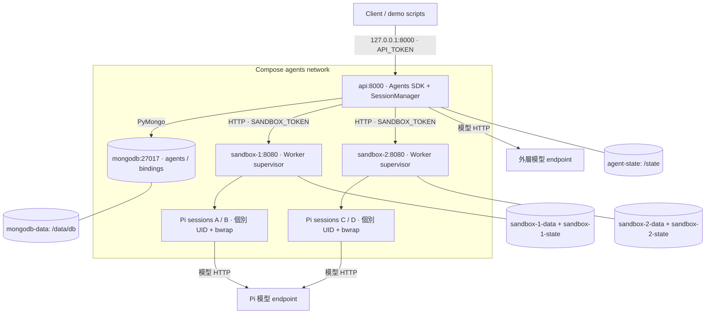
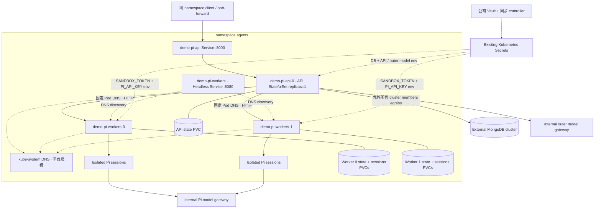

# 部署架構與服務總覽

## Docker Compose overview

下圖對應預設 `docker compose up --build -d --wait`。共四個長駐服務：API、MongoDB、sandbox-1、sandbox-2。Pi session 程序按需建立，不會在啟動時自動建滿。

| 服務 | 長駐程序 | Network／對外入口 | 持久化 |
|---|---|---|---|
| api | 1 Uvicorn process；SDK、manager、cleanup 在同一 process | host loopback API_PORT（預設 8000）→ 8000 | agent-state `/state/conversations.sqlite` |
| mongodb | mongod | 27017，未發布 host port | mongodb-data `/data/db` |
| sandbox-1 | 1 Uvicorn supervisor + 按需 Pi／Python 子程序 | 8080，未發布 host port | sandbox-1-data `/sessions`、sandbox-1-state `/state` |
| sandbox-2 | 同上 | 同上 | sandbox-2-data、sandbox-2-state |
| 模型 endpoints | 外部服務，不由 Compose 建立 | API 與 Pi 分別使用自己的 base URL | 由模型供應端管理 |

`.env` 提供設定；API 等 MongoDB 與 workers healthy 才啟動。MongoDB 啟動 script 只在空 volume 建立應用使用者，不會在每次啟動重設帳密。API `/ready` 檢查 MongoDB；worker `/health` 不代表每個 Pi session 都成功啟動或模型可用。

預設限制：每個 worker 2 CPU／2 GiB／512 PIDs、最多 8 個 sessions；MongoDB 1 GiB memory、WiredTiger cache 0.25 GiB。API 在 Compose 沒有設定 CPU／memory limit。這些是設定值，不是經壓測得到的容量承諾。詳見 [compose.yaml](../../compose.yaml)。

## Kubernetes Helm overview

以下以 release `demo`、namespace `agents`、預設 2 workers 為例。`pi.fullname` 為 `demo-pi`。Chart 產生兩個 StatefulSets、兩個 Services、預設兩個 NetworkPolicies；不部署 MongoDB、Vault、模型 gateway、Ingress 或 LoadBalancer。

DNS 方塊表示叢集提供的 kube-system DNS，並非 Chart 或 agents namespace 建立的服務。虛線表示設定／發現關係；實線表示請求或儲存關係。實際固定路由如：`http://demo-pi-workers-0.demo-pi-workers.agents.svc:8080`。Headless Service 提供 DNS，API 不把 session 請求送到任意 worker 的負載平衡地址。

| Chart 資源 | 數量／預設 | 設計目的 |
|---|---|---|
| API StatefulSet / Pod | 1 / 1 | 單 process 的 Agent locks 與 SQLite history |
| Worker StatefulSet / Pods | 1 / N（預設 2） | 固定 ordinal 身分，個別 session 存放位置 |
| API ClusterIP Service | 1，8000 | 同 namespace 入口；無外部 ingress |
| Worker Headless Service | 1，8080 | 固定 Pod DNS |
| API PVC | 1，1 GiB | conversation history |
| Worker PVC | 每 Pod 2 個，state 1 GiB + sessions 10 GiB | UID metadata 與 session files；合計 1 + 2N PVCs |
| NetworkPolicy | enabled 時 2 個 | API／worker 各自 ingress／egress 規則 |
| Secrets、StorageClass、DNS | 平台預先提供 | Chart 引用，不負責建立 Vault integration 或 CSI |

兩個 StatefulSets 均為 `OnDelete`，PVC `Retain`；升級不會主動終止正在執行的 sessions。API 以非 root UID 1000 執行；worker 使用 `hostUsers:false`，Pod 內 root supervisor 再降權啟動各 session。需要支援此模式的節點、runtime、CSI 與 admission 設定。

NetworkPolicy 預設允許同 namespace Pods 進入 API:8000、API 進入 worker:8080，以及 API／worker 到 kube-system DNS。**預設沒有模型或 MongoDB egress**；部署到公司環境時必須加入 gateway、MongoDB 所有 replica-set members／SRV targets 的網路規則。MinIO 若被程式使用，也需另行開放；套件已安裝不代表服務已部署或可連線。

Vault 同步後的 DB Secret 僅注入 API。應用 Secret 的 outer key 給 API、Pi key 給 worker；CA Secret 可選掛到 API。Secret env 不會隨 Secret 修改更新現有程序，需安排重建 Pod。完整設定見 [Helm README](../../charts/pi-sandbox/README.md) 與 [Kubernetes 手冊](../kubernetes.md)。

## 擴縮容與故障恢復

增加 worker replicas 後，先等待 worker ready，再於無工作期間重建 API Pod，讓其取得重新渲染的 SANDBOX_ENDPOINTS。減少 replicas 前，先清理最高 ordinal 的所有 bindings／sessions；不做跨 worker 自動搬移。API 不可直接增為多副本。

Worker 重建後用原 PVC 中的 UID metadata 及 transcript 恢復；重新連線才重建 Pi process，不會延續原程序記憶體。若 worker／PVC 遺失，MongoDB 路由本身無法還原檔案。備份應協調 MongoDB、API history 與 worker PVCs；本專案沒有自動 backup controller 或一致性 snapshot 工具。
