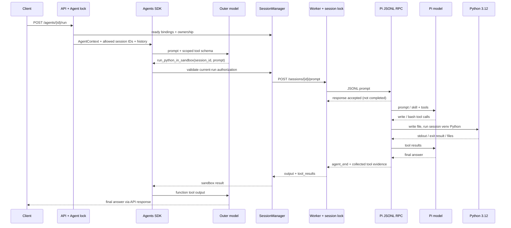

# Agent、session 與執行架構

## 識別與所有權

| 識別 | 用途 | 儲存／存活範圍 |
|---|---|---|
| agent_id | 邏輯 Agent 所有權、SDK history key | MongoDB agents；API history |
| session_id | 指定 Pi 對話與工作目錄 | MongoDB bindings、worker metadata、session directory |
| sandbox_id | 決定 HTTP endpoint／固定 worker | MongoDB binding；SANDBOX_ENDPOINTS |
| RPC request id | 對應 JSONL request／response future | 單個 PiRPC 的記憶體 |
| Pi toolCallId／entry id | 工具結果與對話分支關聯 | Pi transcript |

目前 API_TOKEN 是 sample 共用服務憑證，並非多租戶使用者登入；Agent ownership 防止跨 Agent 誤用 session，但持有共用 token 的 client 不是各自隔離的 tenant。

## 完整 prompt 路徑

SDK tool schema 的 session_id enum 只含當次允許的 ready sessions，工具本身再檢查 allowed_sessions，Manager 以 Agent ID 檢查 binding。外層第一次要求工具呼叫；後續可整合答案，`parallel_tool_calls=False`，`max_turns=12`。同 Agent 請求序列化；不同 Agent 可並行。這不是背景 job queue，HTTP client 必須等待執行結果。

## 配置、保留與 cleanup

建立 session 時，Manager 從健康 worker 選擇目前 binding count 最少者（或指定 sandbox），先寫 allocating binding，再呼叫 worker idempotent PUT。Worker 在 allocation lock 下檢查 MAX_SESSIONS、配置 UID slot／目錄、啟動 Pi。成功後改 ready；結果不確定時保留 ID 與路由以便 reconnect／DELETE。

| 狀態 | 允許的操作與恢復方式 |
|---|---|
| allocating | reconnect 或 DELETE；尚不能 prompt |
| ready | prompt、resources、packages、retention、DELETE |
| deleting | 禁止 prompt／reconnect；刪除可重試 |
| binding 不存在 | worker 刪除成功後移除；後續 session 查詢 404 |

managed 不會閒置到期；ephemeral 預設 TTL 3600 秒。API 每 60 秒選取過期與 pending-delete bindings，取得 Agent lock 後再驗證，worker 再確認未 busy／未最近活動，停止 namespace、移除檔案與本地 row 後才刪 MongoDB binding。失敗保留 deleting，後續重試。MongoDB 沒有 TTL index。

Pi process 暫停是另一條生命週期：worker 預設 300 秒 idle 即 disconnect，保留所有持久化資料與 session 名額；binding 仍可 ready。下次操作重新啟動 Pi 並載入同一 transcript。`SESSION_CLEANUP_INTERVAL_SECONDS=0` 停用 API 與 worker 背景 sweeps；手動 cleanup API 仍可使用。詳見 [Session lifecycle](../session-lifecycle.md)。

## 雙層模型連線

| 層 | Base URL／key／model | Transport 選擇 |
|---|---|---|
| 外層 SDK | OPENAI_BASE_URL／OPENAI_API_KEY／OPENAI_MODEL | 未指定 mode：有自訂 URL 用 chat_completions，否則 responses |
| Pi | PI_BASE_URL／PI_API_KEY／PI_MODEL | 未指定 URL 與 mode 時用內建 openai provider；有自訂 transport 時預設 chat_completions |
| Helm | api.* 與 sandbox.* | values 明確設 mode，覆蓋程式的推導行為 |

兩個端點可以完全不同。Compose 的 Pi key 空值會 fallback 到 OPENAI_API_KEY；公司部署應明確分開設定，Helm worker 只取得 PI_API_KEY。Pi 自訂 provider models.json 保存 `$PI_API_KEY` 參照而非 literal secret，並支援 context window、max tokens 與 compat 選項。設定錯誤不會自動 fallback 到 public endpoint。這裡指 OpenAI-compatible 模型協定，不是只有 OpenAPI schema 就足夠；gateway 需支援所選 transport、tools 與 Pi 所需的 streaming。設定細節見 [configuration](../configuration.md)。

## Skills、extensions 與 packages

Bootstrap 在 session UID／namespace 內複製 image seeds；skills、extensions 進入 HOME，package sources 進入 /workspace/packages。每個 session 自己管理 settings、安裝清單與 npm cache。

Skill 是模型指令，不是自動執行成功的證據。Extension 可註冊模型工具、headless commands 與 audit hooks。Pi package 可同時帶 extensions、skills、prompts、Python helpers；本機 stats-kit 安裝後提供 python_stats tool 與 /package-stats command。Package install/remove 先停止 Pi，再在相同隔離環境執行 CLI，成功後載入原 transcript；失敗不保證回滾。

一般 prompt 等 agent_end 才完成；原生 extension command 若 handler 結束且未啟動模型，支援不經 agent_end 的回傳路徑。此 RPC client 未實作互動對話框；extension 不應把任意文字直接印到 JSONL stdout。詳見 [resources](../resources.md)。

## 錯誤與證據

PROMPT_TIMEOUT 預設 180 秒，Manager HTTP timeout 為其值 + 60 秒、connect 5 秒。Worker prompt timeout／取消會 disconnect Pi。外層 OpenAI client max_retries=0；不要在 HTTP 結果不確定時重送 prompt，它可能已寫檔或執行副作用。

RPC 回應證據有界：最多 32 個 tool results、每個序列化結果 8000 字元、output 32000 字元；完整原生 transcript 在 session state，但原生工具也可能截斷輸出。大量結果應寫成 artifacts。

應用 tracing 將 HTTP request、outer history、sandbox_results、Pi transcript、extension audit 與實際檔案交叉核對；沒有跨層統一 trace ID、逐 delta 保存或 syscall tracing。OPENAI_AGENTS_DISABLE_TRACING=1 不影響這些本地證據。Token ledger 分開計算 outer SDK 與 Pi，cached input 只計一次，缺失 usage 不當成 0；collect 既有 transcript 得到的是累積值。完整重跑方式見 [驗證手冊](../session-verification.md)。
