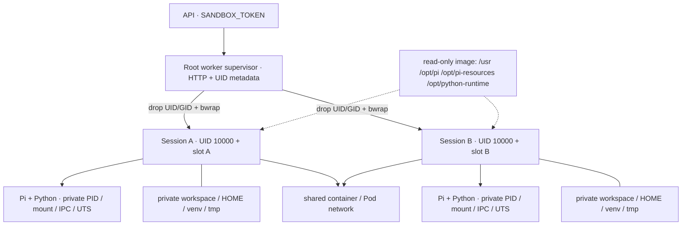

# Sandbox 隔離、資源與信任邊界

## Session environment overview

每個 worker 有自己的 UID slot registry；有效 slot 1..55535，UID=10000+slot。session root 由 supervisor 擁有，data 目錄由該 UID 擁有；生成程式不能替換 bind-mount source。Session 中的 `/workspace` 對應 worker 的 `/sessions/<session-id>/data`。

## 隔離與可見性矩陣

| 資源 | Session A 對自己的存取 | 對 Session B／supervisor 的存取 |
|---|---|---|
| workspace、HOME、venv | 可寫，持久化 | sibling directories 不掛載，UID 不同 |
| /tmp、/run、/proc、/dev | 個別 tmpfs／namespace 視圖 | 不共享 PID namespace／tmpfs |
| /usr、/opt/pi、resource seeds、Python inventory | 唯讀共享 | 不可改 image libs |
| /opt/server、worker /state、API history | 不掛載 | 無法經 session filesystem 存取 |
| 網路 | 共用 container／Pod network | 沒有 per-session network namespace 或 policy |
| Pi model key | 該 session env 可讀 | 不注入 API_TOKEN、SANDBOX_TOKEN、MongoDB credentials |
| CPU／memory | 與其他 sessions 共用 container／Pod 配額 | 沒有 per-session cgroup 配額 |

Bootstrap、extension、package hooks、生成 Python 全部在 session UID／Bubblewrap 裡運行。Supervisor 使用 root 只為配置與降權；不是讓 root 直接執行模型生成程式。關閉 namespace init／process group 會清理其子程序，刪除檔案及 metadata 後才可重用 UID slot。

## Linux／Kubernetes 前提

Compose 允許 nested namespace 所需 syscalls，使用 seccomp／AppArmor unconfined、systempaths unconfined，保留 no-new-privileges 並只加入 SETUID、SETGID、CHOWN、DAC_OVERRIDE、KILL capabilities；不使用 privileged 或 Docker socket。

Helm worker 需要 Pod user namespaces (`hostUsers:false`) 且允許 nested Bubblewrap。API 使用非 root 與 RuntimeDefault seccomp；worker 的 Unconfined／Unmasked 設定可能被公司 admission 拒絕，必須依 [Kubernetes 手冊](../kubernetes.md) 驗證節點／runtime／CSI。不允許隔離失敗後降級成未隔離執行。

這個模型提供同 worker 的檔案與程序隔離，仍共享 kernel、網路及資源池。任意第三方 extension／package 可使用 session model key 並連往允許的網路；不能視為不可信多租戶的完整安全平台。API／worker service token 需由部署邊界保護，HTTP 服務間目前沒有 mTLS，Chart 沒有 TLS ingress。

## Python 與資源安裝

Image build 使用 uv.lock export sandbox group，以 uv pip 或 pip 搭配 hashes 預先安裝 Python 3.12 application packages。目前有 numpy、rich、requests、minio；sqlite3 為標準函式庫。/opt/server 是 supervisor 專用環境，不掛入 sessions。

每個 session 使用 Python 3.12 venv --system-site-packages，讀取 image libs，也可在自己的 venv 安裝已有的本機 wheel。預設 PIP_NO_INDEX=1、PIP_REQUIRE_VIRTUALENV=true、UV_OFFLINE=true、UV_PYTHON_DOWNLOADS=never；缺套件時更新 image，不能依賴 runtime public pip index。Pi/npm/git 遠端來源並非由這些 Python flags 阻擋，需以 Pod egress policy 管理。

Build 產生 packages.json 與 SYSTEM.md；Pi 透過 append-system-prompt 得知預裝套件，bootstrap 另產生該 session 的有效 inventory。已建立的 session resources 是可寫副本，更新 image 不會覆寫既有修改。詳見 [Python packages](../python-packages.md)。

## 資源回收與邊界

| 限制 | 設定／實作 | 範圍 |
|---|---|---|
| Session 名額 | MAX_SESSIONS，預設 8 | worker；暫停也占名額 |
| Process／FD／file | RLIMIT_NPROC 128、NOFILE 256、FSIZE 128 MiB、CORE 0 | session 子程序繼承；不是整體磁碟 quota |
| Container 資源 | Compose limits／Helm resources | 所有 sessions 共享 |
| 閒置程序 | PI_IDLE_DISCONNECT_SECONDS，預設 300 秒 | 暫停 Pi，資料保留 |
| 閒置 session | ephemeral TTL + cleanup | 完整停止並刪除 session data |

RLIMIT_FSIZE 限制單檔，不阻止多個小檔耗盡 volume。PVC 容量與 Pod memory 是總體邊界；本版沒有每 session disk quota、hard token budget、工作排程公平性或自動擴容。縮容前需清掉目標 ordinal 的資料與 bindings；保留證據需先 collect，cleanup 不會自動備份。
