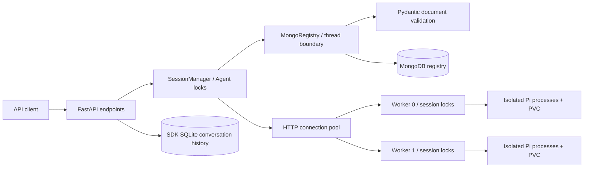

# MongoDB registry 架構設計

目標是在多個長駐 sandbox 間保存穩定的 Agent → session → worker 路由，並讓 session 保留、清理、API 重啟具有可恢復狀態。本版是 **單 API process + 多 worker**；MongoDB 負責持久化，沒有將程序內鎖變成分散式鎖。

## 元件與責任



| 元件 | 責任 | 不負責 |
|---|---|---|
| `orchestrator/app.py` | API 認證、UUID/request schema、取得 Agent lock、startup/readiness/shutdown | 不直接發送 MongoDB query |
| `SessionManager` | 所有權、worker 選擇、HTTP 呼叫、狀態轉換、TTL、cleanup 協調 | 不保存生成程式、不直接操作 worker 檔案 |
| `MongoRegistry` | PyMongo 連線池、document CRUD、indexes、一般化資料庫錯誤 | 不決定 TTL 政策、不重試 prompt、不取得 worker lock |
| `documents.py` | typed document 與 update models、序列化、跨欄位驗證 | 不提供 foreign key、CAS、distributed lease 或 server validator |
| Worker | 本地 UID/活動 metadata、每 session lock、Pi 程序、檔案／namespace 清理 | 不取得 MongoDB 憑證、不自行刪除 registry |

Collection 欄位、查詢與索引的完整規格見 [schema／index design](mongodb-schema.md)。

## 非阻塞 DB 邊界與錯誤

Registry 使用一個 thread-safe PyMongo MongoClient，database operations 經 `asyncio.to_thread` 進入執行緒。FastAPI event loop 可持續處理其他 Agent 的工作；driver server selection／connect／socket timeout 預設 5000ms。這不是整個 request 的 deadline；一個 registry operation 可能包含多個 DB commands。

取消等待無法停止已開始的 Python thread。因此 `database_operation` 使用 shield，呼叫端取消時仍等待同步操作結束，再傳遞 CancelledError。這讓上層的 Agent lock 不會先釋放、而 DB 寫入稍後又與清理交錯。shutdown 先停止 cleanup task，等待它結束後再關閉 HTTP pool 與 MongoClient。

PyMongo 例外轉成 `503 MongoDB registry unavailable`；讀取 document 驗證失敗轉成 `503 Invalid MongoDB registry document`，不傳出 URI、原始 driver exception 或損壞的欄位值。程式內寫入資料不符合 models 時拋 ValidationError，應修復呼叫端；不要把 model validation 當作可重試的資料庫斷線。

`/health` 是程序存活，`/ready` ping MongoDB。Startup 建立 indexes，再啟動 cleanup。MongoDB 故障時回報錯誤；worker 上的工作可能已經執行，不能因 registry 503 而自動重送 prompt。

## 配置與執行流程

1. API 建立 Agent document。建立 session 前先檢查 Agent 存在。
2. SessionManager 從健康 worker 中依 registry count 選擇 worker，或使用 caller 指定的 sandbox ID。Count 是分配參考，worker 的 MAX_SESSIONS 才是本地名額檢查；不是跨 Agent 的原子容量預留。
3. 先插入 `allocating` BindingDocument，再呼叫 worker 的 idempotent PUT。
4. Worker 成功啟動後更新活動時間與 `ready`；若網路結果不確定，保留 allocating binding 和原 ID，供明確 reconnect／DELETE。
5. Prompt、connect、resource/package API 在 Agent lock 內操作，worker 再取得 session lock。工作完成或失敗後更新活動時間／expires_at。
6. 對外仍回傳 dict 的 `id`，DB 使用 `_id`；此相容邊界由 document model 統一處理。

MongoDB 與 worker HTTP 之間沒有 distributed transaction。每個狀態都是下一次恢復動作的依據，不是「HTTP 200 一定代表所有外部副作用都可回滾」的保證。

## Cleanup 流程

```mermaid
sequenceDiagram
    participant Sweep as API cleanup
    participant Lock as Agent lock
    participant DB as MongoRegistry
    participant Worker as Bound worker
    Sweep->>DB: query deleting OR expired ephemeral
    Sweep->>Lock: skip busy; acquire available lock
    Sweep->>DB: reread current binding + validate
    Note over Sweep,DB: recheck retention/activity; dry-run stops here
    Sweep->>DB: status = deleting
    Sweep->>Worker: DELETE with idle_before
    Worker->>Worker: check lock + activity; stop Pi; delete files + local metadata
    alt success
        Worker-->>Sweep: deleted
        Sweep->>DB: delete binding
    else recently active / busy
        Worker-->>Sweep: 409
        Sweep->>DB: restore prior status + refresh activity
    else unavailable / uncertain result
        Worker-->>Sweep: timeout or error
        Note over Sweep,DB: keep deleting; retry deletion in later sweep
    end
```

候選清單是 snapshot，不是保留／預約。取得 lock 後再次讀取，可能已被另一輪 cleanup 刪除或更新；此時跳過。單次失敗不應移除 binding；worker DELETE 可重試，prompt 不自動重試。Worker 暫停閒置 Pi 是另一個機制，只釋放程序資源、保留本地資料與 registry 名額。

Managed sessions 不會因閒置到期刪除；已經明確 DELETE 而留下 deleting 的 managed session，仍會重試完成刪除。API 停止時不清除 registry；worker 仍可暫停閒置程序。孤兒檔案不會被目錄掃描盲目刪除。

## 一致性與並行限制

- MongoDB `_id` unique index 防止重複 Agent／session IDs；Pydantic 規範欄位形狀，不取代 unique index。
- BindingUpdate 的 read → validate merged document → `$set` 不是 MongoDB transaction／CAS。本版依賴所有正式呼叫端持有同一 API process 的 Agent lock。不要從其他 process 或 mongosh 同時修改 lifecycle 欄位。
- 只有 `$set` 的單次 DB command 是 document-level atomic；無跨 documents／collections 的 transaction，也無跨 MongoDB／worker 的 transaction。
- 刪除先記錄意圖，worker 確認後才刪 binding；MongoDB delete 最後失敗時，保留 deleting 可重試 idempotent worker DELETE。
- 多 API replicas 需要 shared history backend、distributed leases／fencing、容量預留與狀態條件更新；只換成 MongoDB 不足以支援。
- List／cleanup candidates 目前會載入整個結果，count 使用全 collection aggregation；沒有 pagination、batch limit 或持久化 cleanup audit。應先量測再擴展，不能把現在的 sample 當成無上限 session platform。

## 設定、權限與部署

Compose 提供本機 MongoDB；Helm 僅連 external cluster。Vault 將憑證同步到 Kubernetes Secret，Chart 以 env 注入 API；URI／密碼不放 values、不傳入 worker。CA 可用 Secret 掛載。API 帳號需要 registry database 的 readWrite 與 createIndex；不需要 root。

API StatefulSet 保持一個 replica，worker 使用固定 ordinal DNS 與獨立 PVC。縮容、Secret 輪替、OnDelete 更新仍需先等待工作完成，見 [Kubernetes 手冊](kubernetes.md)。MongoDB 資料、API SDK history、worker state／sessions 應一起納入一致性備份與恢復計畫。

## Schema evolution

Document models 使用 extra forbid，外部插入的未知欄位會被拒絕。新 schema 部署前應確認資料與讀取端相容，必要時先完成資料修正。

## 測試與可驗證範圍

```bash
uv run --locked pytest tests/test_documents.py tests/test_registry.py tests/test_manager.py tests/test_lifecycle.py -q
make check
make test-mongodb
make test-container
```

單元測試包含 model invariants、alias round-trip、partial update、壞 document、index keys、request cancellation、所有權、持久化與 cleanup 競態。`test-mongodb` 使用真實本機 MongoDB 的獨立測試 databases；`test-container` 驗證無外網的真實 Pi／隔離流程，但 registry 使用 mock。

這些測試不代表公司 replica set failover、TLS／Vault lease 輪替、K8s admission／CSI 已完成驗證，也沒有負載壓測、query explain 效能基準或分散式 API 並行保證。
