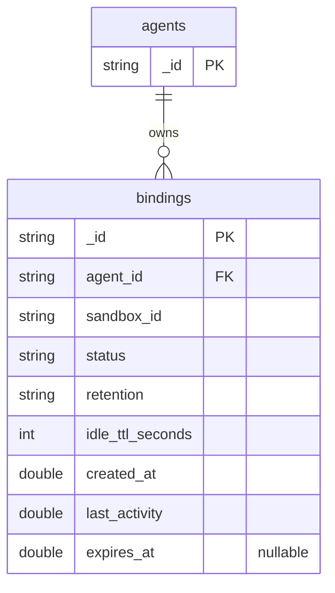

# MongoDB schema 與 index design

本文件描述預設 database `pi_agents`。Database 名稱由 `MONGODB_DATABASE` 設定。可執行的 document schema 來源是 [`orchestrator/documents.py`](../orchestrator/documents.py)，index 建立位置是 [`MongoRegistry.initialize`](../orchestrator/registry.py)。架構與生命週期見 [registry 架構設計](mongodb-registry-architecture.md)，部署／憑證見 [MongoDB 操作手冊](mongodb.md)。

## Collection 關係



`agent_id` 是邏輯關聯，不是 MongoDB foreign key。Session Manager 配置前確認 Agent 存在，所有 session API 以 Agent ID 限定 binding；MongoDB 不提供跨 collection FK 或 cascade delete。Worker 的檔案與 UID metadata 不存進這些 documents。

## 1. agents — AgentDocument

| 欄位 | BSON／Python | 必填 | 規則與用途 |
|---|---|---|---|
| `_id` | string／str | 是 | 唯一 Agent ID；API 產生 UUID 字串 |

```json
{"_id":"be710040-96c6-48a2-a3ca-27b60884feb4"}
```

Document model 要求非空、無空白的 string IDs；對外 FastAPI path 要求 UUID。MongoDB ObjectId 不是此專案的 ID 格式。此 collection 不含對話、模型 key 或 Agent 執行鎖。建立時沒有額外的隱含時間欄位。

## 2. bindings — BindingDocument

| 欄位 | BSON／Python | 必填 | 規則與用途 |
|---|---|---|---|
| `_id` | string／str | 是 | session ID，MongoDB 原生唯一鍵 |
| `agent_id` | string／str | 是 | 不可變的所有權關聯 |
| `sandbox_id` | string／str | 是 | 不可變的 worker 身分；對應 SANDBOX_ENDPOINTS key |
| `status` | string／Literal | 是 | `allocating`、`ready`、`deleting` |
| `retention` | string／Literal | 是 | `managed` 或 `ephemeral` |
| `idle_ttl_seconds` | integer／int | 是 | 非負整數；不接受 bool 或字串轉型 |
| `created_at` | double／float | 是 | 新資料為建立時間 Unix 秒；不可變，亦用於排序 |
| `last_activity` | double／float | 是 | 最近完成 connect／prompt／resource 操作的 Unix 秒 |
| `expires_at` | double 或 null／float \| None | 是，可 null | ephemeral 的清理門檻，managed 固定 null |

所有時間數值都要求非負且有限，不接受 NaN／Infinity。這些欄位使用數字秒，**不是 BSON Date**。既有 numeric integer 時間能讀取為 float。

```json
{
  "_id":"7c2a909a-079b-46d9-9a36-cc79a8a36073",
  "agent_id":"be710040-96c6-48a2-a3ca-27b60884feb4",
  "sandbox_id":"demo-pi-workers-0",
  "status":"ready",
  "retention":"ephemeral",
  "idle_ttl_seconds":3600,
  "created_at":1780000000.0,
  "last_activity":1780000100.0,
  "expires_at":1780003700.0
}
```

跨欄位規則：

- managed：`idle_ttl_seconds == 0` 且 `expires_at is None`。
- ephemeral：TTL 必須大於 0，且 `expires_at == last_activity + idle_ttl_seconds`，浮點絕對誤差允許 1e-6 秒。
- Model 不判斷欄位之間的歷史先後或是否已到期；清理時才比較目前時間，避免把合法的過期 document 判成壞資料。
- `deleting` 表示已要求刪除或刪除結果尚未確認，不代表檔案一定消失。這時禁止 reconnect／prompt，保留記錄供重試。

不保存 prompt、生成程式、token ledger、模型 key、MongoDB URI、程序 handle 或目錄內容。這些資料有各自的儲存／權限邊界。

## 3. Pydantic 邊界與更新規則

所有 models 使用 strict mode、`extra='forbid'`、不可變 instance、禁止非有限數值；錯誤字串隱藏輸入值。Python 屬性 `id` 對應 MongoDB alias `_id`。

```python
from orchestrator.documents import BindingDocument, BindingUpdate

stored = {
    "_id": "session-a", "agent_id": "agent-a", "sandbox_id": "sandbox-1",
    "status": "ready", "retention": "managed", "idle_ttl_seconds": 0,
    "created_at": 10.0, "last_activity": 20.0, "expires_at": None,
}
document = BindingDocument.model_validate(stored)
assert document.to_mongo()["_id"] == "session-a"
assert document.public()["id"] == "session-a"  # API 相容格式
updated = BindingUpdate(
    retention="ephemeral", idle_ttl_seconds=10, expires_at=30.0,
).apply(document)
```

`BindingUpdate` 只接受 status、retention、idle_ttl_seconds、last_activity、expires_at。未提供欄位表示不變；明確 null 僅允許 expires_at。`id/_id`、agent_id、sandbox_id、created_at 不可修改。

更新時先讀現有 BindingDocument，套用 patch 並重新驗證完整 document，再發送 `$set`（不 replacement、不 upsert）。因此不能只將 retention 改成 ephemeral 而忘記 TTL／expiration，也不能任意換掉路由。整筆 document 驗證不使用 `model_copy(update=...)`，因為該方法不驗證更新值。

此驗證是 **Python application 層**，目前沒有安裝 MongoDB `$jsonSchema` validator。直接透過 mongosh／其他 client 寫入仍可能繞過驗證。逐筆讀取（含 list／cleanup candidates）遇到不合法 document 會回一般化 503，不默默忽略欄位或套預設；aggregate counts 只計算分組，不載入每筆完整 model。遇到壞資料時需由管理者盤點修復，不應跳過檢查繼續清理。

可用 `BindingDocument.model_json_schema(by_alias=True)` 檢視欄位 JSON Schema，但 `model_validator` 的跨欄位規則不會完整轉成 JSON Schema，不能把它直接視為等價 MongoDB server validator。

## 4. Index design

`initialize()` 可重複執行；不使用 TTL、稀疏或 partial indexes。除 MongoDB 自動建立的 `_id_` 外，目前由 API 建立以下 indexes：

| Collection／index 名稱 | Keys（皆 ascending） | Unique | 對應查詢與理由 |
|---|---|---|---|
| agents／`_id_` | `_id` | 是 | Agent 存在檢查；不需要第二個 id index |
| bindings／`_id_` | `_id` | 是 | session 定位、更新、刪除；加上 agent_id 條件仍最多檢查一筆 |
| bindings／`agent_id_1_created_at_1__id_1` | agent_id, created_at, _id | 否 | 指定 Agent，依 created_at 與 _id 排序列出 sessions；_id 是同時間的排序 tie-breaker |
| bindings／`sandbox_id_1` | sandbox_id | 否 | worker 分組／營運查詢；目前 counts 使用全 collection `$group` |
| bindings／`status_1` | status | 否 | 找出所有 deleting bindings，供失敗後重試 |
| bindings／`retention_1_expires_at_1` | retention, expires_at | 否 | retention 等值 ephemeral，expires_at 範圍 `<= now` |

查詢形狀：

```javascript
// Agent 的 session 列表：等值 prefix + 完整排序。
db.bindings.find({agent_id: "agent-a"}).sort({created_at: 1, _id: 1})
// 所有權：唯一 _id 定位，再檢查 agent_id，不需再建 (_id, agent_id)。
db.bindings.findOne({_id: "session-a", agent_id: "agent-a"})
// 清理候選：兩個分支分別有對應 index。
db.bindings.find({$or: [
  {status: "deleting"},
  {retention: "ephemeral", expires_at: {$lte: 1780003700.0}}
]})
// 負載估算，不是容量 lease／原子預留。
db.bindings.aggregate([{$group: {_id: "$sandbox_id", count: {$sum: 1}}}])
```

索引可供 planner 選擇，不保證在所有資料分布下使用 IXSCAN；counts 仍需處理整個集合，不能宣稱有 sandbox index 就是 O(1)。應使用實際資料的 `explain('executionStats')` 檢查 scanned documents、排序與 latency，再決定是否需要 counters／分頁／batch cleanup。

舊版的 `agent_id_1_created_at_1` index 不能完整提供 `_id` tie-breaker 排序。本版新增三欄 index，但**不自動刪除舊 index**。既有 DB 升級後可能同時保留兩者，帶來額外儲存與寫入成本；平台確認新 index 已建好、所有讀取端已升級且 explain 符合預期後，再於維護流程移除舊 prefix index。不要刪除 `_id_` 或把 expires_at 改成 TTL index。

## 5. 為何不使用 MongoDB TTL index

MongoDB 的自動 TTL 刪 document 不會等待 Pi 停止、檔案清理，也不會取得 Agent／worker lock。若先移除 binding，API 便失去路由／所有權資訊，worker 可能繼續占用程序、磁碟與 session 名額。因此 expires_at 僅為 **應用清理候選查詢值**；成功刪除 worker 後才呼叫 registry delete。完整流程見 [架構設計](mongodb-registry-architecture.md)。

## 6. 相容性與測試

Document 形狀與目前 MongoDB registry 相容，不新增必填版本欄位、不更換 ID 型別。新增未知欄位需要同步升級 model 與讀取端；extra forbid 是刻意的 fail-closed 行為。未來變更欄位應規劃 reader compatibility、資料 migration 與回滾，不能直接在正式 DB 任意改 document。

`tests/test_documents.py` 驗證 BSON/API round-trip、strict types、過期規則、immutable fields、patch、讀取壞資料，以及 indexes keys／沒有 TTL。`make test-mongodb` 也會使用真正 MongoDB 執行 repository 與 index 測試。
